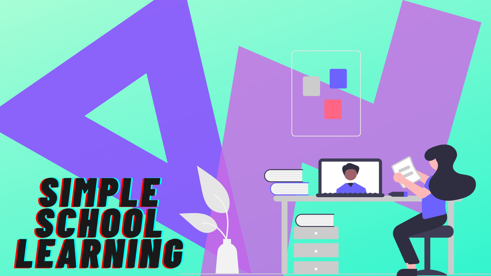

# Simple school learning



Simple school learning is a [Strapi](https://strapi.io/)/[Next.js](https://nextjs.org/) based application which aims to create a simple but powerfull tool to create small courses.

This aims to support you with creating some variety for learning basic elementary School things.

See working demo [here](https://monosnap.com/file/mtHxcFrjMceOFN8V9KKnoB2cetcNaW).

## Installation

To install the backend and the frontend, run the following commands:

*You need to make sure you have the following node version: `v12 OR v14`*

*You need to make sure you use yarn or npm version: `v6`*

```bash
$ yarn install
```

> This should also run yarn install for the `backend` and `frontend` folder.

## Development

To start the development server, run the following command:

```bash
$ yarn dev
```
